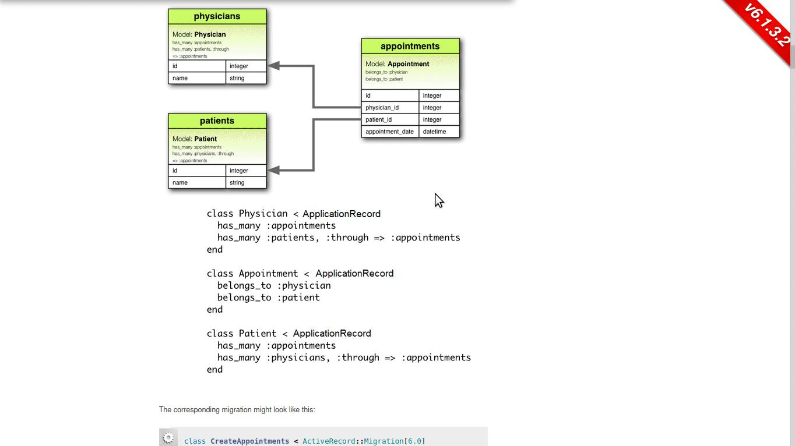
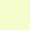

# EAD (Entity Association Diagram)

EAD is a tool to initialize any Ruby on Rails project quickly by implementing associations from a generated JSON file.

EAD contains two parts;

- A user interface(called as EAD) to generate JSON file
- A gem(called as EAD gem) to modify the files of Ruby on Rails project by using the generated JSON file

This repository contains code of the user interface.

EAD gem can be accessible from [this repository](https://github.com/ozovalihasan/ead-g) or [rubygems.org](https://rubygems.org/gems/ead) 

## Live Demo

Please check [live demo of EAD.](https://ead.ozovalihasan.com/)

## Built With

- React
- react-beautiful-dnd
- Redux Toolkit
- styled-components
- Jest

## Getting Started

Producing ERD is the first starting point of any Ruby on Rails project. But, implementing ERD to a Ruby on Rails project can be time consuming and repetitive. 

More, arrows are used to represent associations on ERD. It can be hard to follow these arrows if any entity has a lot of associations.

EAD is designed to solve these two problems. Firstly, EAD is using containers moved by drag-and-drop gesture. Any container can be collided and expanded. It allows to read associations by going from outer containers to inner ones easily.

Secondly, a JSON file can be produced by using EAD quickly and this JSON file can be implemented into a Ruby on Rails project by EAD gem. So, any project can be started with ready associations without consuming any time.

### Prerequisites

- A modern web browser (Firefox or Chrome is suggested).
- A new Ruby on Rails project

### Usage

EAD can be accessible with any modern browser. To learn how to use EAD, check [this document](./documents/how-to-use.md). A JSON file should be generated by clicking 'Download EAD' button when all associations are ready. 

Install EAD gem by running `gem install ead`.

Then, there are two choices to use the generated JSON file;
- Run `ead 'path_of_the_generated_file'` in the root folder of your Ruby on Rails project. Don't forget to put quotation marks(').
- Move the generated JSON file (its name must be 'EAD.json') to the root folder of your project and run `ead`. 

⚠️: Save your files before running the gem.

⚠️⚠️: Please double check generated files by the gem.

⚠️⚠️⚠️: EAD is still under development. So, it is not recommended to use this gem with ongoing projects. 

### Features

- Any container can be collided by using  and expanded .
- Containers in another container can be aligned vertically by using  and horizontally by using .
- Any drop area can be chosen to work by using flag (checkbox without flag  and with flag  ).
  * Selected container is shown with .
- All enabled containers can be moved with . Disabled containers cannot be moved(). 
  * Enabled containers are shown with   .
  * Disabled containers and drop areas are shown with .
  * Coupled dragged containers and drop areas are shown with .
  * Dragged containers being removed are shown with .
- EAD can be reset to initial state by clicking 'Reset' button.
- EAD can be saved to localStorage by clicking 'Save' button.
- EAD can be installed with data from localStorage by clicking 'Install Saved Data' button.

Note: EAD allows to use any drag containers and drop areas by default. But, it is suggested to select a drop area with flag and then drag any enabled container.

## Test EAD

- Clone this repository
- Open terminal
- Change directory by using `cd ead`
- Run `npm install`
- Run `npm test` to test all files

# Authors

Reach out to me at one of the following places!

👤 **Hasan Özovalı**

- Website: [ozovalihasan.com](https://www.ozovalihasan.com/)
- LinkedIn: [Hasan Özovalı](https://www.linkedin.com/in/hasan-ozovali/)
- Github: [@ozovalihasan](https://github.com/ozovalihasan)
- Twitter: [@ozovalihasan](https://twitter.com/ozovalihasan)
- Mail: [ozovalihasan@gmail.com](mailto:ozovalihasan@gmail.com)

## 🤝 Contributing

Contributions, issues and feature requests are welcome!

Feel free to check the [issues page](https://github.com/ozovalihasan/ead/issues).

## Show your support

Give a ⭐️ if you like this project!

## License

- **[MIT license](http://opensource.org/licenses/mit-license.php)**
 