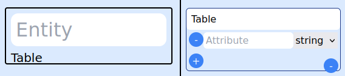
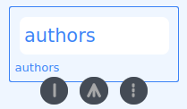

  

# EAD (Entity Association Diagram)

EAD is a tool to initialize any Ruby on Rails project quickly by implementing associations from a generated JSON file.

EAD contains two parts;

- A user interface(called 'EAD') to generate JSON file
- A gem(called 'EAD gem' or 'ead') to modify the files of a Ruby on Rails project by using the generated JSON file

This repository contains the code of the user interface.

EAD gem can be accessible from [this repository](https://github.com/ozovalihasan/ead-g) or [rubygems.org](https://rubygems.org/gems/ead) 

## Live Demo 

Please check [live demo of EAD.](https://ozovalihasan.com/ead)

## Examples

- Three [videos](https://drive.google.com/drive/folders/1ijDYvCQVRRb6kozWTUv3zUCs2EEGSWej?usp=sharing) are provided as example. If you want to check videos for previous versions, please check [this link](https://drive.google.com/drive/folders/1PrS0zW3H-ZKMjhHDAXTN2vRz-flhLDdE?usp=sharing).

## Built With

- React
- TypeScript
- React Flow
- zustand
- Vite
- Tailwind CSS
- Jest
- pnpm

## Getting Started

Preparing ERD is the first step of any Ruby on Rails project. But, implementing ERD to a Ruby on Rails project can be time-consuming and repetitive. EAD is designed to solve these problems.

EAD is using drag and drop mechanism. Also, a new approach is used to draw associations between entities. Entities and tables are separated completely. So, multiple entities stored by one table can be defined easily.

More, a JSON file can be produced by using EAD quickly and this JSON file can be implemented into a Ruby on Rails project by the EAD gem. So, any project can be started with ready associations without consuming any time.

EAD is not an intermediate step between ERD and the process of adding associations. EAD is developed to be used instead of ERD.
### Prerequisites

- A modern web browser (Firefox or Chrome is suggested).
- A new Ruby on Rails project

### Usage

EAD can be accessible with any modern browser. To learn how to use EAD, check [this document](./documents/how-to-use.md). A JSON file should be generated by the clicking 'Download EAD' button when all associations are ready. 

Install EAD gem by running `gem install ead`.

Then, there are two choices to use the generated JSON file;
- Move the generated JSON file (its name must be 'EAD.json') to the root folder of your project and run `ead`. 
- Run `ead 'path_of_the_generated_file'` in the root folder of your Ruby on Rails project. Don't forget to put quotation marks(').

⚠️: Save your files before running the gem.

⚠️⚠️: Please double-check the files generated by the gem.

⚠️⚠️⚠️: EAD is still under development. So, it is not recommended to use this gem with ongoing projects. 

- If all files are generated as expected, run `bundle exec rails db:migrate`.
### Features

- All association buttons are shown when the cursor is hovering on an entity. 

- Any table, association, attribute can be deleted as shown in [the document](./documents/how-to-use.md#How-to-add-and-delete-tables-and-their-attributes).
- 'has_many' association can be added by using .
- 'has_one' association can be added by using .
- ':through' association can be added by using .
- Polymorphic associations can be added easily.
- STI models can be added easily.
- The EAD file can be downloaded by clicking the "Download EAD" button.
- Any EAD file can be uploaded by clicking the "Upload EAD" button and selecting a file. EAD file generated by v0.4.0, v0.4.1, v0.4.2, v0.4.3, v0.4.4 and v0.4.5 can be uploaded without any problem.
- EAD can be reset to the initial state by clicking the 'Reset' button.

- Dark mode is available.
- Main color can be changed.
- Showing the name of associations is an option.

## Run EAD locally

- Download [Node.js](https://nodejs.org/en/download/)
- Install pnpm globally by running `npm install -g pnpm`
- Run `pnpm install`
- Run `pnpm run dev`

## Test EAD

- Install pnpm globally by running `npm install -g pnpm`
- Run `pnpm install`
- Then, run `pnpm run test`

# Author

Reach out to me at one of the following places!

👤 **Hasan Özovalı**

- Website: [ozovalihasan.com](https://www.ozovalihasan.com/)
- LinkedIn: [Hasan Özovalı](https://www.linkedin.com/in/hasan-ozovali/)
- Github: [@ozovalihasan](https://github.com/ozovalihasan)
- Twitter: [@ozovalihasan](https://twitter.com/ozovalihasan)
- Mail: [ozovalihasan@gmail.com](mailto:ozovalihasan@gmail.com)

## 🤝 Contributing

Contributions, issues and feature requests are welcome! 

Feel free to check the [issues page](https://github.com/ozovalihasan/ead/issues).

## Show your support

Give a ⭐️ if you like this project!

## License

- **[MIT license](http://opensource.org/licenses/mit-license.php)**
 