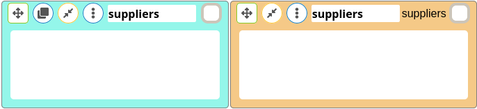
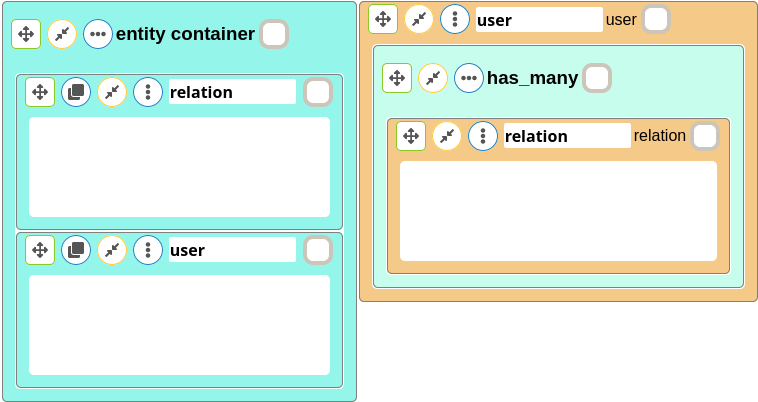

Entity Association Diagram
==========================

This document explains how to use EAD(Entity Association Diagram )

After reading this document, you will know:

* How to generate basic associations for Ruby on Rails

--------------------------------------------------------------------------------

The Types of Associations
-------------------------

EAD supports five types of associations:

* [`belongs_to`](#The-belongs_to-Association)
* [`has_one`](#The-has_one-Association)
* [`has_many`](#The-has_many-Association)
* [`has_many :through`](#The-has_many-:through-Association)
* [`has_one :through`](#The-has_one-:through-Association)


In the remainder of this documentation, you'll learn how to declare and use the various forms of associations. But first, a quick introduction to the situations where each association type is appropriate.

[`belongs_to`]: https://api.rubyonrails.org/classes/ActiveRecord/Associations/ClassMethods.html#method-i-belongs_to
[`has_many`]: https://api.rubyonrails.org/classes/ActiveRecord/Associations/ClassMethods.html#method-i-has_many
[`has_one`]: https://api.rubyonrails.org/classes/ActiveRecord/Associations/ClassMethods.html#method-i-has_one

### The `belongs_to` Association

belongs_to association is added automatically.

### The `has_one` Association

For example, if each supplier in your application has only one account, you'd declare the supplier model like this:

```ruby
class Supplier < ApplicationRecord
  has_one :account
end

class Account < ApplicationRecord
  belongs_to :supplier
end
```


The corresponding migration might look like this:

```ruby
class CreateSuppliers < ActiveRecord::Migration[6.1]
  def change
    create_table :suppliers do |t|
      t.string :name

      t.timestamps
    end
  end
end

class CreateAccounts < ActiveRecord::Migration[6.1]
  def change
    create_table :accounts do |t|
      t.string :account_number
      t.references :supplier, null: false, foreign_key: true

      t.timestamps
    end
  end
end
```

### The `has_many` Association

 For example, in an application containing authors and books, the author model could be declared like this:

```ruby
class Author < ApplicationRecord
  has_many :books
end

class Book < ApplicationRecord
  belongs_to :author
end
```


The corresponding migration might look like this:

```ruby
class CreateAuthors < ActiveRecord::Migration[6.1]
  def change
    create_table :authors do |t|
      t.string :name

      t.timestamps
    end
  end
end

class CreateBooks < ActiveRecord::Migration[6.1]
  def change
    create_table :books do |t|
      t.datetime :published_at
      t.references :author, null: false, foreign_key: true

      t.timestamps
    end
  end
end

```


### The `has_many :through` Association

 For example, consider a medical practice where patients make appointments to see physicians. The relevant association declarations could look like this:

```ruby
class Physician < ApplicationRecord
  has_many :appointments
  has_many :patients, through: :appointments
end

class Appointment < ApplicationRecord
  belongs_to :physician
  belongs_to :patient
end

class Patient < ApplicationRecord
  has_many :appointments
  has_many :physicians, through: :appointments
end

```


The corresponding migration might look like this:

```ruby
class CreatePhysicians < ActiveRecord::Migration[6.1]
  def change
    create_table :physicians do |t|
      t.string :name

      t.timestamps
    end
  end
end

class CreatePatients < ActiveRecord::Migration[6.1]
  def change
    create_table :patients do |t|
      t.string :name

      t.timestamps
    end
  end
end

class CreateAppointments < ActiveRecord::Migration[6.1]
  def change
    create_table :appointments do |t|
      t.datetime :appointment_date
      t.references :physician, null: false, foreign_key: true
      t.references :patient, null: false, foreign_key: true

      t.timestamps
    end
  end
end

```

WARNING: The official Ruby on Rails documentation is suggesting one more feature of `has_many :through` as "shortcut" for nested `has_many` associations. But, this feature should be added manually for nest `has_many` associations.

### The `has_one :through` Association

For example, if each supplier has one account, and each account is associated with one account history, then the supplier model could look like this:

```ruby
class Supplier < ApplicationRecord
  has_one :account
  has_one :account_history, through: :account
end

class Account < ApplicationRecord
  belongs_to :supplier
  has_one :account_history
end

class AccountHistory < ApplicationRecord
  belongs_to :account
end
```


The corresponding migration might look like this:

```ruby
class CreateSuppliers < ActiveRecord::Migration[6.1]
  def change
    create_table :suppliers do |t|
      t.string :name

      t.timestamps
    end
  end
end

class CreateAccounts < ActiveRecord::Migration[6.1]
  def change
    create_table :accounts do |t|
      t.string :account_number
      t.references :supplier, null: false, foreign_key: true

      t.timestamps
    end
  end
end

class CreateAccountHistories < ActiveRecord::Migration[6.1]
  def change
    create_table :account_histories do |t|
      t.integer :credit_rating
      t.references :account, null: false, foreign_key: true

      t.timestamps
    end
  end
end
```

### The `has_and_belongs_to_many` Association

`has_and_belongs_to_many` association isn't implemented to make the codebase simpler. 

NOTE: If it is requested, it can be added with the next versions.

### Polymorphic Associations

For example, you might have a picture model that belongs to either an employee model or a product model. Here's how this could be declared:

```ruby
class Picture < ApplicationRecord
  belongs_to :imageable, polymorphic: true
end

class Employee < ApplicationRecord
  has_many :pictures, as: :imageable
end

class Product < ApplicationRecord
  has_many :pictures, as: :imageable
end
```


The corresponding migration might look like this:

```ruby
class CreatePictures < ActiveRecord::Migration[6.1]
  def change
    create_table :pictures do |t|
      t.references :imageable, polymorphic: true, null: false  

      t.timestamps
    end
  end
end

class CreateEmployees < ActiveRecord::Migration[6.1]
  def change
    create_table :employees do |t|

      t.timestamps
    end
  end
end

class CreateProducts < ActiveRecord::Migration[6.1]
  def change
    create_table :products do |t|

      t.timestamps
    end
  end
end

```

### Self Joins

```ruby
class Employee < ApplicationRecord
  belongs_to :subordinate , optional: true, class_name: "Employee"
  has_many :managers, class_name: "Employee", foreign_key: "subordinate_id"
end
```


The corresponding migration might look like this:

```ruby
class CreateEmployees < ActiveRecord::Migration[6.1]
  def change
    create_table :employees do |t|
      t.references :subordinate, null: true, foreign_key: { to_table: :employees }

      t.timestamps
    end
  end
end

```

## Extra Features

EAD has 'attribute' block to add an attribute to any entity.

EAD has 'attribute container' block to put all attributes in an organized block. There is no difference between putting all attributes into an 'entity' block and an 'attribute block' in terms of gem and generated results.

EAD has 'entity container' block to put all entities in an organized block. There is no difference between putting all entities into any block and an 'entity block' in terms of gem and generated results.

## Entity Clones

There is no difference between a clone and real entities if their names are the same for the gem.



Clones are used to reference real entities.


- Model and migration files are generated for name real and clone names;

  

  ```ruby
  class User < ApplicationRecord
    has_many :relations
  end

  class Relation < ApplicationRecord
    belongs_to :user 
  end

  class CreateUsers < ActiveRecord::Migration[6.1]
    def change
      create_table :users do |t|

        t.timestamps
      end
    end
  end

  class CreateRelations < ActiveRecord::Migration[6.1]
    def change
      create_table :relations do |t|
        t.references :user, null: false, foreign_key: true 

        t.timestamps
      end
    end
  end
  ```

- Model and migration files are generated for different real and clone entity names;

  

  ```ruby
  class User < ApplicationRecord
    has_many :following_relations, class_name: "Relation", foreign_key: "famous_person_id"
  end

  class Relation < ApplicationRecord
    belongs_to :famous_person , class_name: "User"
  end

  class CreateUsers < ActiveRecord::Migration[6.1]
    def change
      create_table :users do |t|

        t.timestamps
      end
    end
  end

  class CreateRelations < ActiveRecord::Migration[6.1]
    def change
      create_table :relations do |t|
        t.references :famous_person, null: false, foreign_key: { to_table: :users }

        t.timestamps
      end
    end
  end
  ```

## Delete Blocks

A dragged block is deleted if it is not paired with another block. They are shown with . 
## Warnings

⚠️ The name of entities and attributes can be in any form like 'account_history', 'Account_history', 'Account_histories', 'account_histories', 'AccountHistory', and 'AccountHistories', but space between words is not allowed.

⚠️ EAD gem allows using only one ':through' block inside of 'entity' block. It is planned to fix this issue.

⚠️⚠️⚠️ If any real entity is put into one of its clones, it may cause different problems(For example, deleting a real entity inside of one of its clones breaks EAD). It is planned to fix this issue with the next versions.

## Suggested Approach

It is highly suggested to put all real entities into one block and use clones for associations. But, this approach isn't mandatory.


## Edge Cases

- The name of entities cannot contain space. But, there is only one exception. If, "has_many :through" association is used between clones of the same entities, the middle entity should be 'one_entity || second_entity'. 

