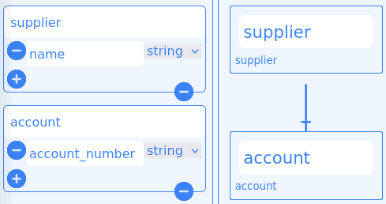
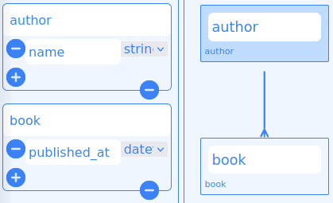
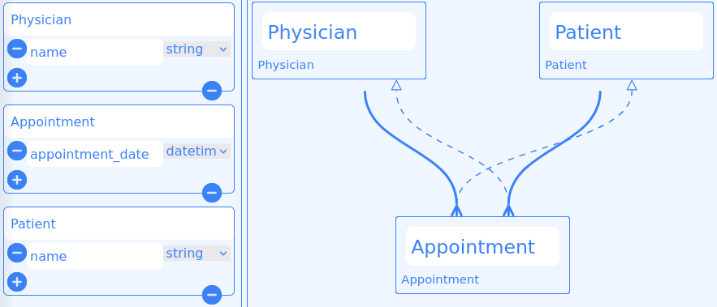
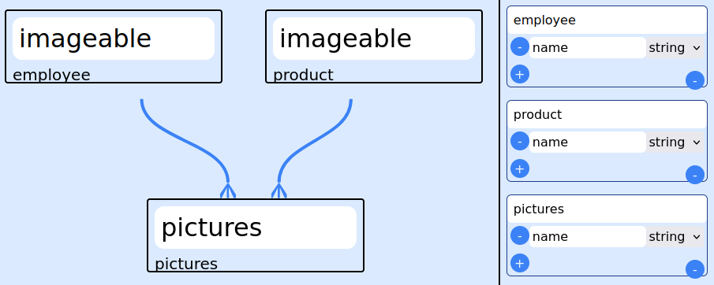
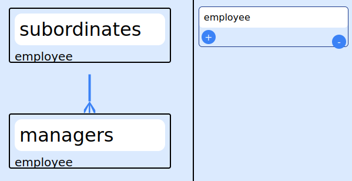
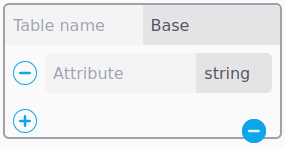
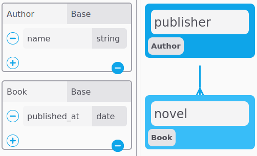
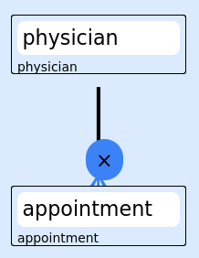
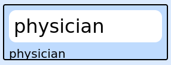
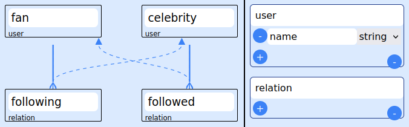

# Entity Association Diagram
==========================

This document explains how to use EAD(Entity Association Diagram )

After reading this document, you will know:

* How to generate basic associations for Ruby on Rails

---

## The Types of Associations


EAD supports seven types of associations:

* [`belongs_to`](#The-belongs_to-Association)
* [`has_one`](#The-has_one-Association)
* [`has_many`](#The-has_many-Association)
* [`has_many :through`](#The-has_many-:through-Association)
* [`has_one :through`](#The-has_one-:through-Association)

In the remainder of this documentation, you'll learn how to declare and use the various forms of associations. But first, a quick introduction to the situations where each association type is appropriate.

[`belongs_to`]: https://api.rubyonrails.org/classes/ActiveRecord/Associations/ClassMethods.html#method-i-belongs_to
[`has_many`]: https://api.rubyonrails.org/classes/ActiveRecord/Associations/ClassMethods.html#method-i-has_many
[`has_one`]: https://api.rubyonrails.org/classes/ActiveRecord/Associations/ClassMethods.html#method-i-has_one

### The `belongs_to` Association

belongs_to association is added automatically.

### The `has_one` Association

For example, if each supplier in your application has only one account, you'd declare the supplier model like this:

```ruby
class Supplier < ApplicationRecord
  has_one :account
end

class Account < ApplicationRecord
  belongs_to :supplier
end
```




The corresponding migration might look like this:

```ruby
class CreateSuppliers < ActiveRecord::Migration[6.1]
  def change
    create_table :suppliers do |t|
      t.string :name

      t.timestamps
    end
  end
end

class CreateAccounts < ActiveRecord::Migration[6.1]
  def change
    create_table :accounts do |t|
      t.string :account_number
      t.references :supplier, null: false, foreign_key: true

      t.timestamps
    end
  end
end
```

### The `has_many` Association

 For example, in an application containing authors and books, the author model could be declared like this:

```ruby
class Author < ApplicationRecord
  has_many :books
end

class Book < ApplicationRecord
  belongs_to :author
end
```





The corresponding migration might look like this:

```ruby
class CreateAuthors < ActiveRecord::Migration[6.1]
  def change
    create_table :authors do |t|
      t.string :name

      t.timestamps
    end
  end
end

class CreateBooks < ActiveRecord::Migration[6.1]
  def change
    create_table :books do |t|
      t.datetime :published_at
      t.references :author, null: false, foreign_key: true

      t.timestamps
    end
  end
end

```


### The `has_many :through` Association

 For example, consider a medical practice where patients make appointments to see physicians. The relevant association declarations could look like this:

```ruby
class Physician < ApplicationRecord
  has_many :appointments
  has_many :patients, through: :appointments
end

class Appointment < ApplicationRecord
  belongs_to :physician
  belongs_to :patient
end

class Patient < ApplicationRecord
  has_many :appointments
  has_many :physicians, through: :appointments
end

```





The corresponding migration might look like this:

```ruby
class CreatePhysicians < ActiveRecord::Migration[6.1]
  def change
    create_table :physicians do |t|
      t.string :name

      t.timestamps
    end
  end
end

class CreatePatients < ActiveRecord::Migration[6.1]
  def change
    create_table :patients do |t|
      t.string :name

      t.timestamps
    end
  end
end

class CreateAppointments < ActiveRecord::Migration[6.1]
  def change
    create_table :appointments do |t|
      t.datetime :appointment_date
      t.references :physician, null: false, foreign_key: true
      t.references :patient, null: false, foreign_key: true

      t.timestamps
    end
  end
end

```


### The `has_one :through` Association

For example, if each supplier has one account, and each account is associated with one account history, then the supplier model could look like this:

```ruby
class Supplier < ApplicationRecord
  has_one :account
  has_one :account_history, through: :account
end

class Account < ApplicationRecord
  belongs_to :supplier
  has_one :account_history
end

class AccountHistory < ApplicationRecord
  belongs_to :account
end
```


The corresponding migration might look like this:

```ruby
class CreateSuppliers < ActiveRecord::Migration[6.1]
  def change
    create_table :suppliers do |t|
      t.string :name

      t.timestamps
    end
  end
end

class CreateAccounts < ActiveRecord::Migration[6.1]
  def change
    create_table :accounts do |t|
      t.string :account_number
      t.references :supplier, null: false, foreign_key: true

      t.timestamps
    end
  end
end

class CreateAccountHistories < ActiveRecord::Migration[6.1]
  def change
    create_table :account_histories do |t|
      t.integer :credit_rating
      t.references :account, null: false, foreign_key: true

      t.timestamps
    end
  end
end
```

⚠️: It is not necessary to define "has_many :through" and "has_one :through" explicitly. The correct one will be added by EAD gem automatically when EAD gem is run. 

### The `has_and_belongs_to_many` Association

`has_and_belongs_to_many` association isn't implemented to make the codebase simpler. 

NOTE: If it is requested, it can be added with the next versions.

### Polymorphic Associations

For example, you might have a picture model that belongs to either an employee model or a product model. Here's how this could be declared:

```ruby
class Picture < ApplicationRecord
  belongs_to :imageable, polymorphic: true
end

class Employee < ApplicationRecord
  has_many :pictures, as: :imageable
end

class Product < ApplicationRecord
  has_many :pictures, as: :imageable
end
```




The corresponding migration might look like this:

```ruby
class CreatePictures < ActiveRecord::Migration[6.1]
  def change
    create_table :pictures do |t|
      t.references :imageable, polymorphic: true, null: false  

      t.timestamps
    end
  end
end

class CreateEmployees < ActiveRecord::Migration[6.1]
  def change
    create_table :employees do |t|

      t.timestamps
    end
  end
end

class CreateProducts < ActiveRecord::Migration[6.1]
  def change
    create_table :products do |t|

      t.timestamps
    end
  end
end

```

### Self Joins

```ruby
class Employee < ApplicationRecord
  belongs_to :subordinate , optional: true, class_name: "Employee"
  has_many :managers, class_name: "Employee", foreign_key: "subordinate_id"
end
```




The corresponding migration might look like this:

```ruby
class CreateEmployees < ActiveRecord::Migration[6.1]
  def change
    create_table :employees do |t|
      t.references :subordinate, null: true, foreign_key: { to_table: :employees }

      t.timestamps
    end
  end
end

```

## Extra Features

EAD has 'table's and 'attribute's to define tables and their attributes in a Rails project.



EAD has 'entity's and 'association's to define [any association](#The-Types-of-Associations) between entities.
## How does EAD gem work?

- Model and migration files are generated for same table and entity names;

  


```ruby
  class Author < ApplicationRecord
    has_many :books
  end


  class Book < ApplicationRecord
    belongs_to :author 
  end


  class CreateAuthors < ActiveRecord::Migration[6.1]
    def change
      create_table :authors do |t|
        t.string :name

        t.timestamps
      end
    end
  end


  class CreateBooks < ActiveRecord::Migration[6.1]
    def change
      create_table :books do |t|
        t.datetime :published_at
        t.references :author, null: false, foreign_key: true 

        t.timestamps
      end
    end
  end
```

- Model and migration files are generated for different table and entity names;



```ruby
  class Author < ApplicationRecord
    has_many :novels, class_name: "Book", foreign_key: "publisher_id"
  end

  class Book < ApplicationRecord
    belongs_to :publisher , class_name: "Author"
  end

  class CreateAuthors < ActiveRecord::Migration[6.1]
    def change
      create_table :authors do |t|
        t.string :name

        t.timestamps
      end
    end
  end

  class CreateBooks < ActiveRecord::Migration[6.1]
    def change
      create_table :books do |t|
        t.datetime :published_at
        t.references :publisher, null: false, foreign_key: { to_table: :authors }

        t.timestamps
      end
    end
  end

```
## How to add and delete tables and their attributes

The related buttons should be clicked.


## How to add associations

- All necessary buttons will be shown when the mouse hover on an entity.

- 'has_one' association can be added by dragging  handler.
- 'has_many' association can be added by dragging  handler.
- ':through' association can be added by dragging  handler.


## How to delete associations

Firstly, one association should be selected and then 'Delete' key should be pressed or a button, shown when the association is selected, should be clicked.



⚠️: If a table is deleted, the all entities referring to this table will be deleted automatically.


## How to delete entity

Firstly, one entity should be selected and then 'Delete' key should be pressed.



⚠️: If an entity is deleted, the all associations connected to this entity will be deleted automatically.


## Warnings

⚠️ The names of tables, entities and attributes can be in any form like 'account_history', 'Account_history', 'Account_histories', 'account_histories', 'AccountHistory', and 'AccountHistories', but space between words is not allowed.

## Edge Cases

- If there is a through association bidirectionally between two entities referring to the same table, these entities used to define 'through' entity should be separate . 



- If not, [only one entity to define 'through' association](#The-has_many-:through-Association) is enough.

